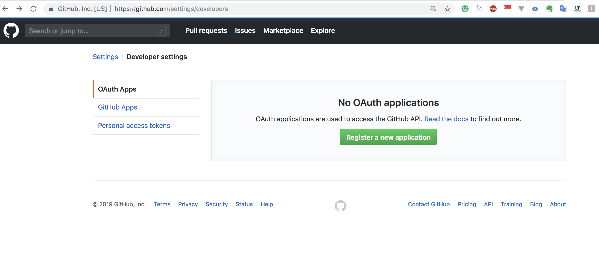
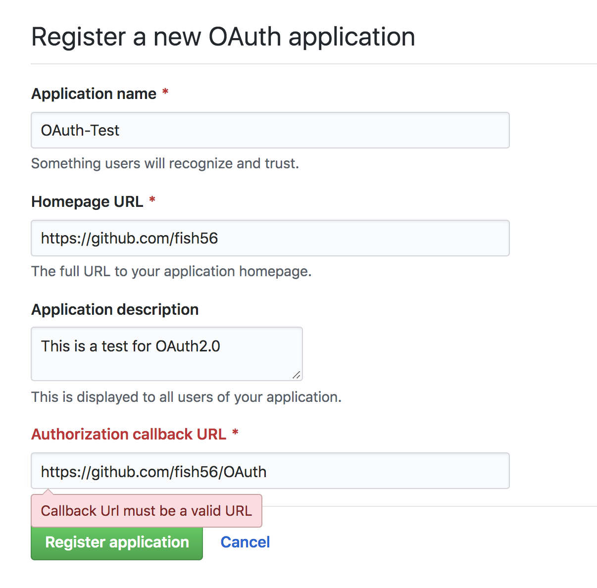
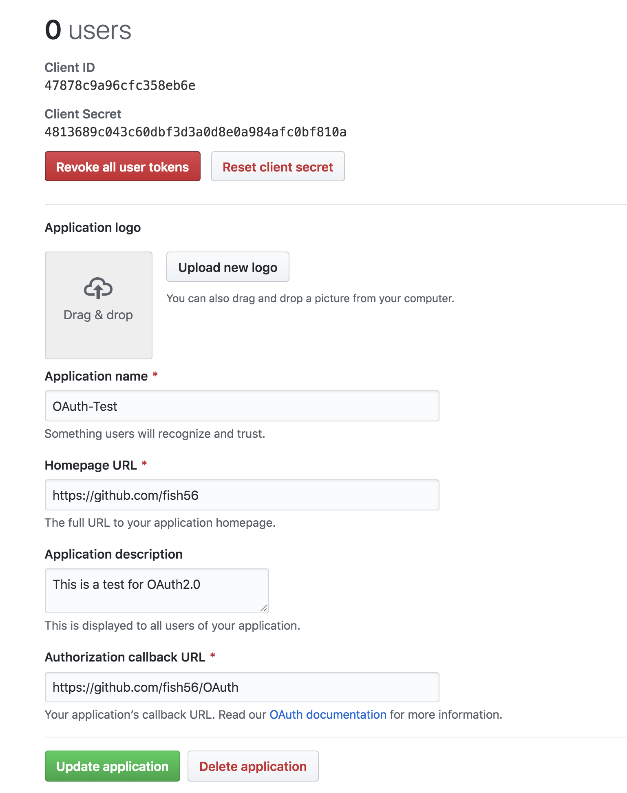
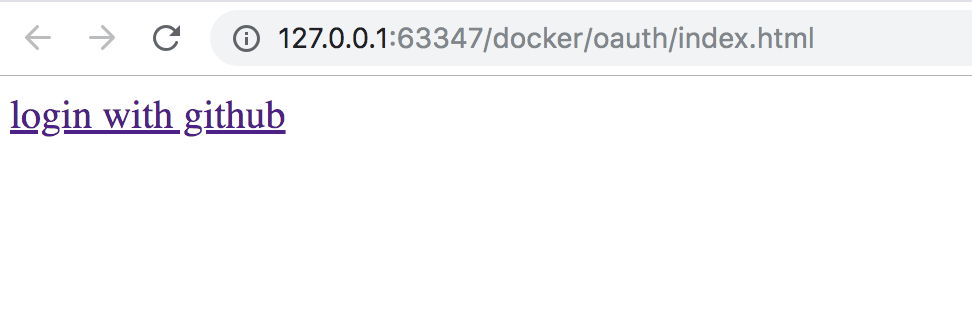
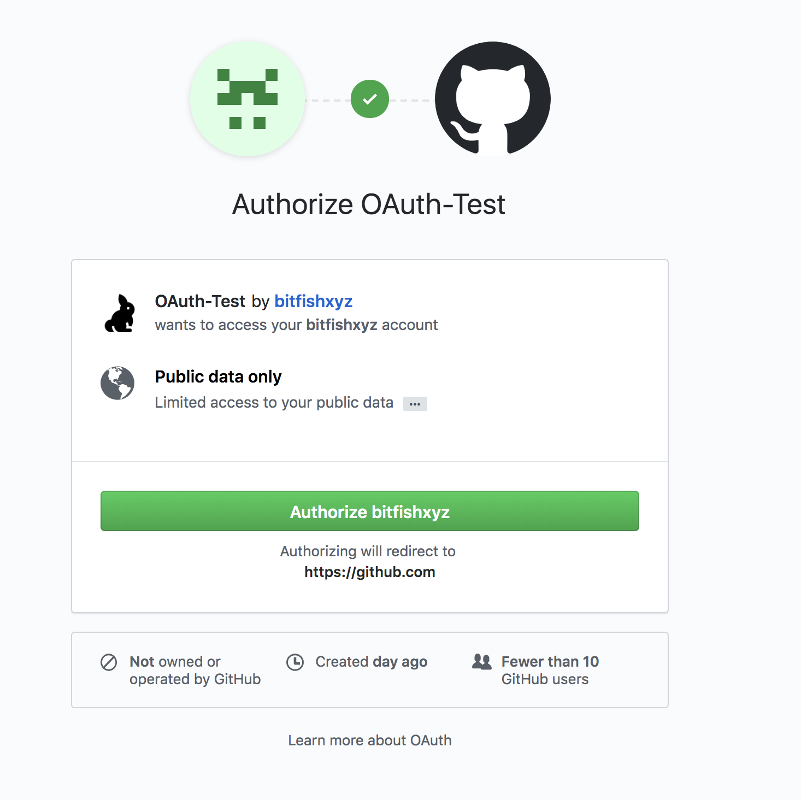
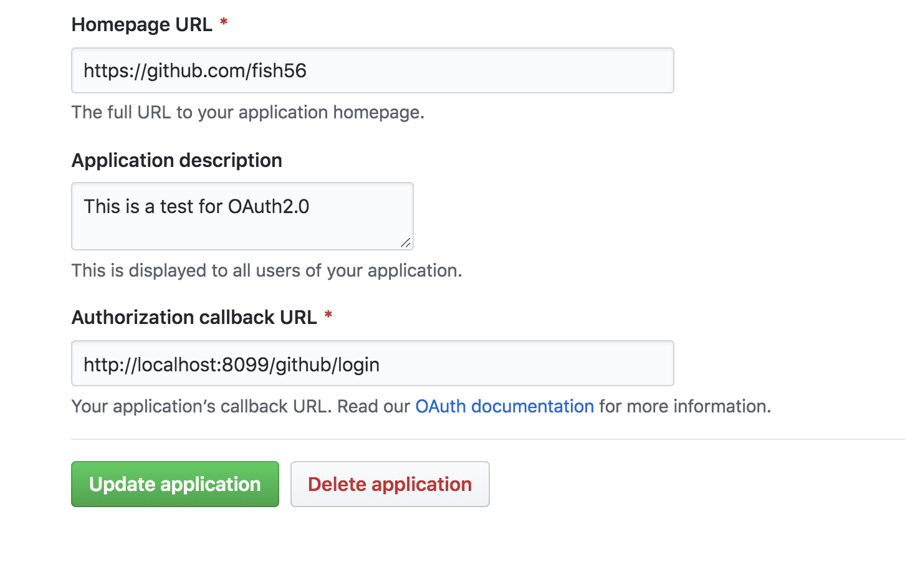
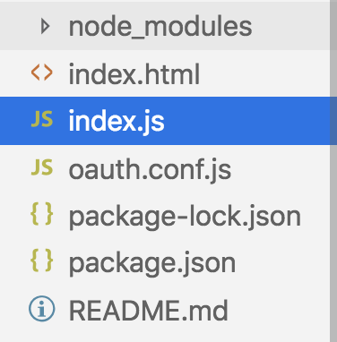
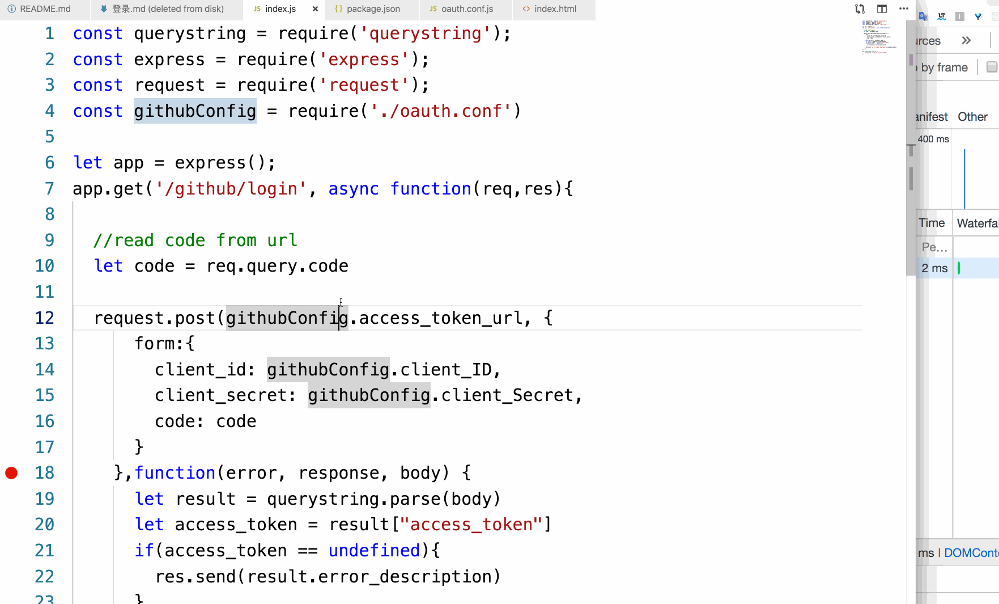

# OAuth

网络上关于Oauth 2.0 协议的基本内容已经很多了，我就不重复写博客了，对基本概念不理解的同学可以先自行Google。但是我发现实际演示的demo很少，所以写了这个偏实战的博客。


-  本文是以GitHub登录为例来演示的。

-  虽然线上环境肯定要有云服务器，但是可以在本地直接模拟调试的

-  不需要写一行代码就可以演示一个完成的登录流程！！请读者务必手动的实际操作！！


其实OAuth认证说白了：

- 有三个角色：

  GitHub，用户，第三方网站third-side

- 需要就是完成一件事：

  经用户同意，让third-side安全的从GitHub拿到一个token


- third-side拿到这个token可以用来
  - 标识一个用户，读取用户的基本信息
  - 代表用户在GitHub上完成一些操作，比如写一个issue之类的

### 基本流程

1. 向GitHub申请注册一个application

   一个application对应一个项目，我们需要拿到一个client id 和 secret来用于后续的登录认证

2. 构造相关的登录链接，引导用户点击登录。这一步需要用到上面的client id

3. 用户同意登录后，third-side可以拿到一个code(后面详细解释)，通过这个code可以向GitHub拿到用户的token

   

#### 第一步注册App

因为我们要使用GitHub作为第三方登录，所以肯定要先到官网上注册一个application。

- 网址： <https://github.com/settings/developers>
- 

点击绿色的按钮就行了，点击后会出现👇的页面：



上面的内容很多，但是只有两个字段是关键的

- `Application Name`： 这个是GitHub 用来标识我们的APP的
- `Authorization callback url`:就是上面我特意用红色字体标识的的，很关键

- Homepage url 这个是展示用的，在我们接下来的登录中用不到，随便写就行了


这个`Authorization callback url`就是在用户确认登录后，GitHub会通过这个url来告知我们的服务器。所以真实情况下这个url应该是由专门的服务器程序来监听的。但是这一步大家可以先跟着我填写，后面细细说。


完成注册后，我们就有了这些数据：



上面有两个数据很关键

- `cliendt_id`这是GitHub用来标识我们的APP的

  接下来我们需要通过这个字段来构建我们的登录url

- `client Secret` 这个很关键，等会我们就靠它来认证的，要好好保存。我这个只是演示教程，用完就销毁了，所以直接公开了。


#### 构造URL

然后我们接下来怎么做？很简单

```html
<body>
  <a href="https://github.com/login/oauth/authorize\
?client_id=47878c9a96cfc358eb6e">
    login with github</a>
</body>
```

我们只要在我们的登录页面添加这样的代码，引导用户点击我们的登录按钮就行了。


注意到上面的流程了吗？ 其实我们已经完成了一半的登录认证流程了，然后我们来分析一下。

首先请大家思考一下：从用户点击`login with github`开始，中间有几次重要的HTTP报文传递？

_不重要是指中间那些网页中附带的对css js资源的请求，这些不算。_

与登录认证有关的http请求有几个？


**3个**！！！说清楚这一点，基本就明白了。


首先我们构造了这样的html页面

``` html
<body>
  <a href="https://github.com/login/oauth/authorize\
?client_id=47878c9a96cfc358eb6e">
    login with github</a>
</body>
```



关键是我们构造了一个url

- `https://github.com/login/oauth/authorize`：

  这一部分是固定的，只要是用GitHub登录，就得这样。你可以从官方文档上看到这个链接。

   如果是微信登录，twitter登录，也是大同小异，具体的url可以在相关的官网上找到。

  GitHub会监听这个路由，来做出登录处理

- 然后后面是一个查询字符串`client_id=47878c9a96cfc358eb6e`。

  它的值就是我们之前申请到的client id。这是个必须存在的字段，用户点击登录后，GitHub就是通过这个字段来确认用户究竟是想登录哪个网站。

然后GitHub会返回这样的页面，确认用户是否真的要登录，这就是第一次HTTP请求和响应





然后用户点击确认后发生了什么？

- 用户点击确认，就是向GitHub发送一个报文，确认自己确实到登录某网站

- GitHub收到这个用户的确认消息，**然后会返回一个状态码为301的报文**

这个是第二次HTTP请求和响应。因为浏览器收到301重定向后，会直接前往新的网址了，所以你要是没仔细看的话，可能就忽略了。

这个状态码为301的报文，它的Location字段大概长这样：`https://github.com/fish56/OAuth?code=a1aee8cacf7560825665>`

- `https://github.com/fish56/OAuth`

  这个字段就是我们之前填写的callback url，正常情况下这个应该是我们云服务器的网址。但是这里为了演示方便，我这里就随便填写了我的github地址，没关系的

- `code=a1aee8cacf7560825665`:

  (因为笔者中间调试过，所以现在写的token和gif里面的不一样哈)

  这个就是我们OAuth登录的一个核心信息。我之前说过，**我们OAuth登录的核心目的就是让第三方网站能够安全的拿到用户的token**。用户的浏览器收到之前的301的HTTP响应后，就会向我们服务器发起请求，请求的同时服务器就拿到了这个code。服务器就可以通过这个code从github拿到用户的token。

这就是第三次http请求。


然后又有同学可能会问了，为什么要返回一个code，而不是直接返回一个token呢？

答：为了安全，如果token经过用户的手里走一遍，就可能会被其他恶意的人窃取。

OAuth协议下，GitHub会返回给用户一个code，然后用户浏览器通过重定向携带这个code来访问我们的服务器，这样服务器就拿到了这个code。

服务器拿到这个code 之后，通过结合之前的client secret向GitHub申请token，这样会安全一点。


之前我们只做了一半， 接下来我们通过postman来演示一下如何通过code拿到token。


# 登录

我们要向GitHub申请用户的token，需要

- code

  这个只有在用户同意登录后，服务器才能拿到。

- client secret + client id

- 向`https://github.com/login/oauth/access_token`发起POST请求，并且携带上面的三个字段

  这个url是GitHub规定的，你可以在它的官方文档中找到

  

然后我们在postman中构造这样的请求：


哎，可以看到，这我们确实拿到了用户的token：

`access_token=9094eb58a23093fd593d43eb28c1f06ce7904ed5&scope=&token_type=bearer`。

只不过真实情况下上面的操作都是由线上的服务器完成的，我这样操作是方便大家的理解。


## 代码实战

通过上面的例子我们可以看到，如果只是演示，我们是不需要服务器。接下来我们在本地用代码直接演示下。


- 演示的代码使用node + express + request 写的
- 不过代码很简单，不了解上面的技术栈也可以看得懂
- 流程上和之前演示的一模一样，只是通过代码来完成


因为我们要启动本地的服务器来监听响应，所以我们首先要修改下我们的callback URL。



请大家将这个callback URL自行修改为`http://localhost:8099/github/login`。


这是我们程序的目录结构



然后这是我们的node代码：

```js
const querystring = require('querystring');
const express = require('express');
const request = require('request');

const githubConfig = require('./oauth.conf')

let app = express();

// 做一个路由函数，监听/github/login 的get请求
app.get('/github/login', async function(req,res){
    
  //read code from url
  let code = req.query.code

  // 收到code后，向GitHub请求用户的token
  request.post(githubConfig.access_token_url, {
      form:{
        client_id: githubConfig.client_ID,
        client_secret: githubConfig.client_Secret,
        code: code
      }
    },function(error, response, body) {
     //正常情况下，返回值应该是形如access_token=9094eb58a23093fd59
     // 3d43eb28c1f06ce7904ed5&scope=&token_type=bearer
     // 的字符串，可以通过下面的函数来解析
      let result = querystring.parse(body)
      
      // 拿到token后，返回结果，表示我们成功了
      let access_token = result["access_token"]
      if(access_token == undefined){
        res.send(result.error_description)
      }
      res.send(`You are login! you token is ${access_token}`)
    })
})

// 监听 8999 ，启动程序。注意端口号要和我们之前填写的保持一致
app.listen(8099,function(){
    console.log('listening localhost:8099')
})
```

这是`oauth.conf.js`

```js
module.exports = {
  client_ID: '47878c9a96cfc358eb6e',
  client_Secret: '4813689c043c60dbf3d3a0d8e0a984afc0bf810a',
  access_token_url: 'https://github.com/login/oauth/access_token'
}
```

这是实际效果




我们的代码做了什么事？只是把我们之前的手动使用postman做的事情自动化了

- 监听`http://localhost:8099/github/login`
- 收到用户浏览器传递的code之后，我们的服务器向GitHub申请了用户token
- 将token返回给用户，表明登录成功

不过其实我上面省略了很多操作。正常情况下，服务器拿到用户的token后，应该：

- 把token保存到数据库
- 通过token从github拿到用户的名称之类的数据
- 不应该把token返回给用户
- 返回给用户一个cookie，使得用户保持登录，并且在数据库中把这个cookie和用户的token对应起来


## 总结

好了，上面基本就是一次登录流程。

- 构造登录链接，引导用户登录
- 用户登录后，GitHub会把用户重定向到我们预先设置好的URL，同时携带一个code
- 服务器拿到这个code，向GitHub申请token
- 拿到token后，服务器就可以确认用户成功登录了，然后可以返回一个登录成功的页面